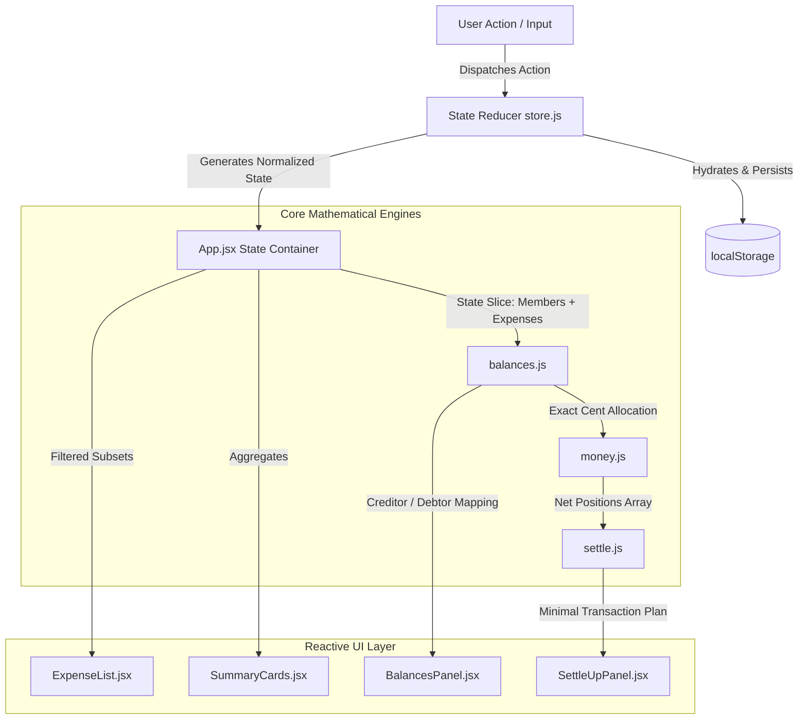

<div align="center">

# 💸 FairShare Splitter

### *Precision group expense splitting, real-time balance tracking, and optimal debt settlement.*

[](https://reactjs.org/)
[](https://vitejs.dev/)
[](https://developer.mozilla.org/en-US/docs/Web/JavaScript)
[](LICENSE)
[](#-system-architecture--data-flow)

</div>

---

## 📖 Overview

**FairShare** is an engineering-grade expense-splitting application engineered to eliminate the chaos of shared trip finances. Whether splitting dinners, cabs, stays, or group activities, FairShare calculates exact individual balances and derives the **mathematically minimal set of peer-to-peer transfers** required to settle all debts with **zero rounding error**.

---

## 🎯 Key Capabilities

* 🪙 **Exact Penny-Precision Engine** — Eliminates fractional-cent drift by distributing remainder cents systematically across participants ($100 split 3 ways $\rightarrow$ exactly $\$33.34 + \$33.33 + \$33.33 = \$100.00$).
* ⚖️ **Closed-Group Conservation Law** — Enforces $\sum \text{Net Balances} \equiv \$0.00$ at all times across all members.
* 🔄 **Optimal Debt Settlement Algorithm** — Greedy $O(N \log N)$ minimum cash flow solver computes the fewest transactions required to clear all group liabilities.
* 👥 **Payer-Independent Splits** — Full support for scenarios where a member pays on behalf of others without participating in the consumption (e.g., booking a cab for teammates).
* 🔍 **Multi-Dimensional Instant Filtering** — Real-time filtering by description query, expense category, and payer with stable ID-based mutation mapping.
* 💾 **State Hydration & Persistence** — Automatic `localStorage` synchronization with robust date object hydration and error resilience.

---

## 🏗️ System Architecture & Data Flow



---

## 📐 Mathematical Foundations

### 1. Conservation of Group Value
FairShare operates on a closed financial network. Every dollar injected by a payer must be balanced by the liabilities of the consumers:

$$\sum_{i=1}^{M} \text{Balance}_i = \sum_{i=1}^{M} \left( \text{Paid}_i - \text{Consumed}_i \right) = 0$$

### 2. Zero-Loss Cents Allocation
Floating-point division ($a / n$) introduces rounding anomalies. FairShare processes all split arithmetic in integral cents:

$$\text{TotalCents} = \lfloor \text{Amount} \times 100 \rceil$$

$$\text{BaseShare} = \lfloor \text{TotalCents} / n \rfloor, \quad \text{Remainder} = \text{TotalCents} \pmod n$$

$$\text{Share}_i = \begin{cases} \frac{\text{BaseShare} + 1}{100} & \text{for } i \le \text{Remainder} \\ \frac{\text{BaseShare}}{100} & \text{for } i > \text{Remainder} \end{cases}$$

$$\sum_{i=1}^{n} \text{Share}_i \equiv \text{Amount}$$

### 3. Greedy Minimum Cash Flow Graph Simplification
To resolve debts in the fewest transactions, positive balances (creditors) and negative balances (debtors) are sorted in descending order of absolute magnitude. The maximum debtor settles against the maximum creditor iteratively:

$$\Delta = \min(|D_{\max}|, |C_{\max}|)$$

$$\text{Transfer}(D_{\max} \xrightarrow{\Delta} C_{\max})$$

---

## 🛠️ Project Structure

```
fairshare-splitter/
├── 📁 src/
│   ├── 📁 components/
│   │   ├── AddExpenseForm.jsx    # Split configuration & validation form
│   │   ├── BalancesPanel.jsx     # Net creditor/debtor balance display
│   │   ├── ExpenseList.jsx       # Chronological expense stream with in-place edits
│   │   ├── Filters.jsx           # Category chips, text search & payer filter
│   │   ├── SettleUpPanel.jsx     # Minimal transfer recommendations
│   │   └── SummaryCards.jsx      # High-level KPIs & group metrics
│   ├── 📁 data/
│   │   └── seed.json             # Seed trip data for immediate onboarding
│   ├── 📁 lib/
│   │   ├── balances.js           # Net individual balance aggregation engine
│   │   ├── format.js             # Internationalized date & currency formatters
│   │   ├── money.js              # Cent-precise equal/percentage split math
│   │   └── settle.js             # Min-cash-flow greedy graph resolution algorithm
│   ├── 📁 state/
│   │   └── store.js              # Reducer logic, persistence & ID-based mutations
│   ├── App.jsx                   # Central controller & reactive state coordinator
│   ├── index.css                 # Clean, responsive typography & theme styles
│   └── main.jsx                  # React application entry point
├── BUGS.md                       # Complete audit log of identified & resolved bugs
├── index.html                    # Application HTML entry point
├── package.json                  # Project manifest
├── README.md                     # Engineering documentation
└── vite.config.js                # Vite build configuration
```

---

## 🔍 Bug Audit & Resolution Matrix

The codebase underwent an end-to-end audit to ensure strict adherence to accounting accuracy, state integrity, and user expectations. Full reproduction and fix details are documented in [`BUGS.md`](./BUGS.md).

| Bug ID | Component | Vulnerability / Defect | Solution |
|---|---|---|---|
| **Bug 1** | `ExpenseList.jsx` | Inverted chronological sorting order | Reversed sort comparator to prioritize newest expenses first |
| **Bug 2** | `App.jsx` | String-to-number type mismatch in payer filter | Applied explicit numerical type casting on filter equality |
| **Bug 3** | `store.js` | Date string deserialization losing `Date` prototype | Implemented `hydrate()` pipeline during state recovery |
| **Bug 4** | `balances.js` | Non-participating payers incorrectly charged shares | Decoupled payer credit from split consumption shares |
| **Bug 5** | `BalancesPanel.jsx` | Inverted balance labels (positive shown as "owes") | Corrected positive as `"is owed"` (credit) and negative as `"owes"` (debt) |
| **Bug 6** | `settle.js` | Exact debt matches (`d === c`) skipped transfer creation | Handled equal debt amounts with guaranteed transfer generation |
| **Bug 7** | `ExpenseList.jsx` | Filtered list index used for store mutation | Converted all deletions and updates to UUID/ID-based targeting |
| **Bug 8** | `money.js` | Fractional penny loss during multi-party splits | Built remainder-preserving integer-cent allocation engine |
| **Bug 9** | `AddExpenseForm.jsx` | Inputs retained stale values after submission | Added form lifecycle reset and updated memoized dependency chains |

---

## ⚡ Quick Start

### Prerequisites
* **Node.js** v18.0.0 or higher
* **npm** v9.0.0 or higher

### Installation & Run

1. **Clone the repository:**
   ```bash
   git clone https://github.com/ruthwik-thotapelli/fairshare-splitter.git
   cd fairshare-splitter
   ```

2. **Install dependencies:**
   ```bash
   npm install
   ```

3. **Start the development server:**
   ```bash
   npm run dev
   ```
   Open [http://localhost:5173](http://localhost:5173) in your browser.

4. **Production Build:**
   ```bash
   npm run build
   npm run preview
   ```

---

## 👤 Author

**Ruthwik Thotapelli**  
* GitHub: [@ruthwik-thotapelli](https://github.com/ruthwik-thotapelli)  
* Repository: [fairshare-splitter](https://github.com/ruthwik-thotapelli/fairshare-splitter)

---

<div align="center">
  <sub>Built with precision for travelers, groups, and engineering excellence.</sub>
</div>
